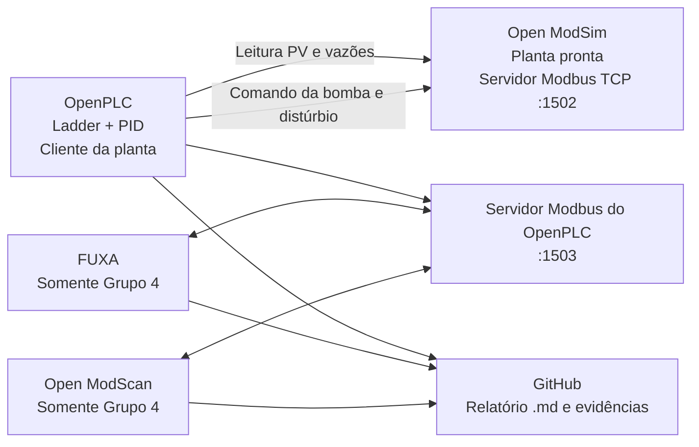

# Laboratório Integrado — Controle de Nível com OpenPLC, Open ModSim, FUXA e Open ModScan

## 1. Finalidade do conjunto

Este conjunto contém quatro roteiros independentes, destinados a quatro grupos de dois alunos. Cada grupo deverá concluir sua atividade em até **50 minutos**, usando uma planta de nível já fornecida e configurada no Open ModSim.

Os quatro trabalhos implementam partes diferentes de um mesmo sistema de controle de nível. Eles poderão ser integrados posteriormente, mas **nenhum grupo dependerá do código, dos arquivos ou dos resultados dos demais durante a aula**.

### Ferramentas

- OpenPLC;
- Open ModSim;
- Open ModScan;
- FUXA, exclusivamente no Grupo 4;
- Git e GitHub para entrega da documentação em Markdown.

### Premissas didáticas

1. A planta do tanque é fornecida pronta.
2. O mapa Modbus básico é fornecido pronto.
3. O OpenPLC é usado por todos os grupos.
4. Toda programação de controle é feita em Ladder.
5. Cada grupo implementa e testa pelo menos uma instância do bloco `PID`.
6. O PID é o sombreamento mínimo e intencional entre os grupos.
7. Apenas o Grupo 4 usa FUXA.
8. Apenas o Grupo 4 precisa usar Open ModScan.
9. Os arquivos de partida reduzem tarefas mecânicas para que a aula caiba em 50 minutos.
10. O relatório final é um arquivo `.md` no repositório GitHub do grupo.

---

# 2. Preparação obrigatória pelo professor

## 2.1 Pacote comum previamente fornecido

O professor deverá disponibilizar, antes da aula, a seguinte estrutura:

```text
lab_controle_nivel/
├── comum/
│   ├── planta_nivel.<extensao_do_OpenModSim>
│   ├── mapa_modbus_unificado.csv
│   ├── variaveis_padrao.csv
│   ├── parametros_conexao.json
│   ├── modelo_relatorio_grupo.md
│   ├── diagrama_arquitetura.svg
│   └── assets/
│       ├── mouse_click.svg
│       ├── seta_vermelha.svg
│       └── caixa_destaque.svg
├── grupo_1/
│   └── G1_PID_BOMBA_base.<extensao_do_OpenPLC>
├── grupo_2/
│   └── G2_PID_SEGURANCA_base.<extensao_do_OpenPLC>
├── grupo_3/
│   └── G3_PID_BLOCOS_base.<extensao_do_OpenPLC>
└── grupo_4/
    ├── G4_PID_FUXA_base.<extensao_do_OpenPLC>
    ├── fuxa_nivel_base.json
    ├── tanque.svg
    └── openmodscan_config_referencia.png
```

> **Importante:** os arquivos nativos do OpenPLC, Open ModSim e FUXA devem ser exportados na mesma versão instalada nos computadores do laboratório. O presente pacote define nomes, mapa, conteúdo e organização, mas o arquivo nativo deve ser validado pelo professor na versão efetivamente usada.

## 2.2 Configuração de rede padronizada

Para execução no mesmo computador:

| Componente | Papel | IP | Porta | Unit ID |
|---|---|---:|---:|---:|
| Open ModSim | Servidor da planta | `127.0.0.1` | `1502` | `1` |
| OpenPLC | Cliente da planta | `127.0.0.1` | `1502` | `1` |
| OpenPLC | Servidor para supervisão/diagnóstico | `127.0.0.1` | `1503` | `1` |
| FUXA | Cliente do OpenPLC | `127.0.0.1` | `1503` | `1` |
| Open ModScan | Cliente do OpenPLC | `127.0.0.1` | `1503` | `1` |

Se os programas estiverem em computadores diferentes, somente os endereços IP deverão ser alterados. Portas, Unit ID, nomes e mapa não devem ser modificados.

## 2.3 Convenção de endereçamento

Todo endereço será apresentado nas duas formas:

- **offset zero-based**, usado na configuração das ferramentas;
- **notação 4xxxx/0xxxx**, usada na documentação.

Exemplo:

- Holding Register offset `0` = `40001`;
- Coil offset `0` = `00001`.

Antes da aula, o professor deve confirmar se a interface instalada exibe offset zero-based ou endereço Modicon. O valor no arquivo de configuração deve ser ajustado uma única vez e mantido igual para todos.

## 2.4 Escalas padronizadas

| Grandeza | Faixa física/lógica | Valor Modbus |
|---|---:|---:|
| Nível | 0,00 a 100,00% | 0 a 10000 |
| Setpoint | 0,00 a 100,00% | 0 a 10000 |
| Comando da bomba | 0,00 a 100,00% | 0 a 10000 |
| Vazão | 0,00 a 100,00% | 0 a 10000 |
| Ganho `KP` | 0,00 a 100,00 | valor × 100 |
| Tempo `TR` | 0,0 a 600,0 s | valor × 10 |
| Tempo `TD` | 0,0 a 60,0 s | valor × 10 |
| Limites de nível | 0,00 a 100,00% | 0 a 10000 |

### Conversões no OpenPLC

```text
NIVEL_PV_PCT := REAL(NIVEL_PV_RAW) / 100.0
NIVEL_SP_PCT := REAL(NIVEL_SP_RAW) / 100.0
BOMBA_CMD_RAW := INT(LIMIT(0.0, BOMBA_CMD_PCT, 100.0) * 100.0)
```

As conversões devem ser realizadas com blocos IEC compatíveis com o editor instalado, como conversão para `REAL`, `DIV`, `MUL`, `LIMIT` e conversão de volta para inteiro.

---

# 3. Mapa Modbus da planta — Open ModSim

## 3.1 Holding Registers da planta

| Offset | Endereço | Nome padronizado | Tipo no PLC | Escala | Acesso pelo OpenPLC | Descrição |
|---:|---:|---|---|---|---|---|
| 0 | 40001 | `NIVEL_PV_RAW` | `UINT` | 0–10000 | leitura | Nível medido do tanque |
| 1 | 40002 | `BOMBA_CMD_RAW` | `UINT` | 0–10000 | escrita | Comando da bomba |
| 2 | 40003 | `VALVULA_SAIDA_CMD_RAW` | `UINT` | 0–10000 | escrita | Abertura da válvula de saída/distúrbio |
| 3 | 40004 | `VAZAO_ENTRADA_RAW` | `UINT` | 0–10000 | leitura | Vazão de entrada |
| 4 | 40005 | `VAZAO_SAIDA_RAW` | `UINT` | 0–10000 | leitura | Vazão de saída |
| 5 | 40006 | `PLANTA_STATUS_WORD` | `UINT` | bits | leitura | Palavra de estado da simulação |

## 3.2 Coils da planta

| Offset | Endereço | Nome padronizado | Tipo | Acesso | Descrição |
|---:|---:|---|---|---|---|
| 0 | 00001 | `PLANTA_ENABLE` | `BOOL` | escrita | Habilita a evolução da planta |
| 1 | 00002 | `PLANTA_RESET` | `BOOL` | escrita | Reinicializa a planta |
| 2 | 00003 | `FALHA_SENSOR_SIM` | `BOOL` | escrita | Injeta falha de sensor |
| 3 | 00004 | `BOMBA_DISPONIVEL_SIM` | `BOOL` | escrita | Simula disponibilidade da bomba |

## 3.3 Estado inicial da planta

```text
PLANTA_ENABLE = TRUE
PLANTA_RESET = FALSE
FALHA_SENSOR_SIM = FALSE
BOMBA_DISPONIVEL_SIM = TRUE
VALVULA_SAIDA_CMD_RAW = 3500
NIVEL_PV_RAW entre 2500 e 3500
```

---

# 4. Mapa Modbus do OpenPLC para FUXA e Open ModScan

Este mapa é usado diretamente somente pelo Grupo 4, mas deve ser mantido como padrão de integração para todos os grupos.

## 4.1 Holding Registers publicados pelo OpenPLC

| Offset | Endereço | Nome | Tipo Modbus | Escala | Permissão |
|---:|---:|---|---|---|---|
| 0 | 40001 | `NIVEL_PV_RAW` | `UINT16` | 0–10000 | leitura |
| 1 | 40002 | `NIVEL_SP_RAW` | `UINT16` | 0–10000 | leitura/escrita |
| 2 | 40003 | `BOMBA_CMD_RAW` | `UINT16` | 0–10000 | leitura |
| 3 | 40004 | `PID_KP_RAW` | `UINT16` | KP × 100 | leitura/escrita |
| 4 | 40005 | `PID_TR_RAW` | `UINT16` | TR × 10 | leitura/escrita |
| 5 | 40006 | `PID_TD_RAW` | `UINT16` | TD × 10 | leitura/escrita |
| 6 | 40007 | `VAZAO_ENTRADA_RAW` | `UINT16` | 0–10000 | leitura |
| 7 | 40008 | `VAZAO_SAIDA_RAW` | `UINT16` | 0–10000 | leitura |
| 8 | 40009 | `PID_XOUT_RAW` | `UINT16` | 0–10000 | leitura |
| 9 | 40010 | `BOMBA_CMD_LIMITADO_RAW` | `UINT16` | 0–10000 | leitura |
| 10 | 40011 | `NIVEL_HH_LIM_RAW` | `UINT16` | 0–10000 | leitura/escrita |
| 11 | 40012 | `NIVEL_LL_LIM_RAW` | `UINT16` | 0–10000 | leitura/escrita |
| 12 | 40013 | `MV_MAX_RAW` | `UINT16` | 0–10000 | leitura/escrita |
| 13 | 40014 | `MV_MIN_RAW` | `UINT16` | 0–10000 | leitura/escrita |

## 4.2 Coils publicadas pelo OpenPLC

| Offset | Endereço | Nome | Permissão | Descrição |
|---:|---:|---|---|---|
| 0 | 00001 | `CMD_START` | escrita | Solicita partida |
| 1 | 00002 | `CMD_STOP` | escrita | Solicita parada |
| 2 | 00003 | `CMD_AUTO` | escrita | Seleciona automático |
| 3 | 00004 | `CMD_RESET_ALARME` | escrita | Reconhece/rearma |
| 4 | 00005 | `ESTADO_RUN` | leitura | Controle habilitado |
| 5 | 00006 | `MODO_AUTO` | leitura | PID em automático |
| 6 | 00007 | `ALARME_HH` | leitura | Nível alto-alto |
| 7 | 00008 | `ALARME_LL` | leitura | Nível baixo-baixo |
| 8 | 00009 | `INTERTRAVAMENTO_ATIVO` | leitura | Há bloqueio ativo |
| 9 | 00010 | `COM_PLANTA_OK` | leitura | Comunicação válida |
| 10 | 00011 | `PID_SATURADO` | leitura | Saída em limite |
| 11 | 00012 | `FALHA_SENSOR` | leitura | Sensor inválido |
| 12 | 00013 | `BOMBA_DISPONIVEL` | leitura | Bomba disponível |
| 13 | 00014 | `COMANDO_MANUAL_ATIVO` | leitura | Controle em manual |

---

# 5. Lista padronizada de variáveis do OpenPLC

## 5.1 Variáveis comuns obrigatórias

| Nome | Tipo IEC | Escala/unidade | Função |
|---|---|---|---|
| `NIVEL_PV_RAW` | `UINT` | 0–10000 | Entrada Modbus bruta |
| `NIVEL_PV_PCT` | `REAL` | % | Variável de processo |
| `NIVEL_SP_RAW` | `UINT` | 0–10000 | Setpoint bruto |
| `NIVEL_SP_PCT` | `REAL` | % | Setpoint do PID |
| `BOMBA_CMD_RAW` | `UINT` | 0–10000 | Saída para a planta |
| `BOMBA_CMD_PCT` | `REAL` | % | Comando final |
| `PID_XOUT_PCT` | `REAL` | % | Saída direta do PID |
| `PID_KP` | `REAL` | adimensional | Ganho proporcional |
| `PID_TR` | `REAL` | s | Tempo integral |
| `PID_TD` | `REAL` | s | Tempo derivativo |
| `PID_AUTO` | `BOOL` | lógico | Automático/manual |
| `PID_MANUAL_PCT` | `REAL` | % | Saída manual `X0` |
| `CONTROLE_ENABLE` | `BOOL` | lógico | Habilitação geral |
| `COM_PLANTA_OK` | `BOOL` | lógico | Estado da comunicação |
| `PID_SATURADO` | `BOOL` | lógico | Saída em 0 ou 100% |
| `PID_NIVEL` | instância `PID` | — | Controlador comum |
| `CICLO_PID` | `TIME` | `T#100ms` | Período do bloco |

## 5.2 Valores iniciais comuns

```text
NIVEL_SP_RAW = 5000
PID_KP = 2.0
PID_TR = 12.0
PID_TD = 0.0
PID_AUTO = TRUE
PID_MANUAL_PCT = 30.0
CICLO_PID = T#100ms
```

## 5.3 Chamada lógica comum do PID

Em todos os projetos, o equivalente funcional deve ser:

```text
PID_NIVEL(
    AUTO  := PID_AUTO,
    PV    := NIVEL_PV_PCT,
    SP    := NIVEL_SP_APLICADO_PCT,
    X0    := PID_MANUAL_PCT,
    KP    := PID_KP,
    TR    := PID_TR,
    TD    := PID_TD,
    CYCLE := CICLO_PID
)

PID_XOUT_PCT := PID_NIVEL.XOUT
```

A representação gráfica deve ser inserida em uma rede Ladder usando o bloco `PID`. A saída do bloco nunca deve ser enviada diretamente à planta sem limitação.

---

# 6. Padrão de imagens e marcações nos roteiros

Cada roteiro deverá conter capturas reais da versão instalada. Para padronizar:

- usar `🖱️` ao lado do texto que descreve um clique;
- usar círculo vermelho numerado para indicar a ordem;
- usar seta vermelha para apontar o botão;
- usar retângulo amarelo semitransparente para destacar campos;
- não recortar menus necessários para orientação;
- ocultar senhas, tokens ou nomes pessoais;
- salvar em `docs/img/`.

### Nomenclatura

```text
G1_01_conexao_modbus.png
G1_02_variaveis.png
G1_03_pid_ladder.png
G1_04_teste_final.png
```

### Modelo de inserção no Markdown

```md
### Configuração da comunicação

🖱️ Clique em **Communication > Modbus Client** e selecione **Add device**.


> A seta vermelha indica o botão **Add device** e o retângulo amarelo destaca IP, porta e Unit ID.
```

---

# 7. Roteiro do Grupo 1 — PID de nível e modulação da bomba

## 7.1 Objetivo

Implementar a malha básica de controle de nível, realizando leitura da variável de processo, escalonamento, execução do PID, limitação da saída e modulação da bomba da planta.

## 7.2 Conhecimentos trabalhados

- comunicação Modbus TCP entre OpenPLC e planta;
- variáveis analógicas em registradores;
- conversão de escala;
- bloco PID em Ladder;
- modo automático e manual;
- saturação de saída;
- resposta a degrau de setpoint;
- registro de evidências técnicas.

## 7.3 Aplicação específica do PID

O PID controla diretamente a velocidade/comando da bomba de entrada para manter o nível no setpoint. Quanto maior o erro positivo `SP − PV`, maior deve ser o comando da bomba.

## 7.4 Divisão entre os alunos

### Aluno A

- conferir os canais Modbus de leitura de nível e escrita da bomba;
- construir as redes de escalonamento da PV e do SP;
- inserir e parametrizar o bloco PID;
- executar o teste de degrau de setpoint;
- produzir as evidências da conexão e da resposta do nível.

### Aluno B

- revisar e editar pelo menos um canal Modbus;
- construir as redes de limitação, saturação e conversão da saída;
- implementar seleção manual/automático;
- executar o teste de modo manual e retorno ao automático;
- produzir as evidências do Ladder e da saída da bomba.

### Trabalho conjunto

- realizar revisão cruzada de nomes e tipos;
- cada aluno deve modificar pelo menos duas redes Ladder;
- ambos devem realizar pelo menos uma ação de teste na planta;
- cada aluno escreve uma subseção do relatório e revisa a subseção do colega.

## 7.5 Arquivos previamente fornecidos

```text
planta_nivel.<extensao>
G1_PID_BOMBA_base.<extensao_OpenPLC>
mapa_modbus_unificado.csv
variaveis_padrao.csv
parametros_conexao.json
modelo_relatorio_grupo.md
```

O projeto inicial já deve conter a tarefa periódica de 100 ms, as variáveis declaradas e os canais Modbus criados, mas as redes do PID e da saída devem estar incompletas.

## 7.6 Sequência de execução — 50 minutos

| Tempo | Atividade |
|---:|---|
| 0–4 min | Abrir a planta e confirmar estado inicial |
| 4–9 min | Conferir IP, porta, Unit ID e canais Modbus |
| 9–15 min | Implementar escalonamento de PV e SP |
| 15–24 min | Inserir e configurar o PID |
| 24–31 min | Limitar e converter a saída da bomba |
| 31–36 min | Implementar manual/automático e saturação |
| 36–43 min | Teste de degrau de setpoint |
| 43–47 min | Teste manual e retorno ao automático |
| 47–50 min | Capturas, commit e verificação do `.md` |

## 7.7 Passo a passo

### Etapa 1 — Abrir e validar a planta

1. Inicie o Open ModSim.
2. Abra o arquivo da planta fornecida.
3. Confirme:
   - servidor ativo;
   - porta `1502`;
   - Unit ID `1`;
   - `PLANTA_ENABLE = TRUE`;
   - `BOMBA_DISPONIVEL_SIM = TRUE`.
4. Não edite a equação ou os parâmetros internos da planta.

**Imagem obrigatória:** `G1_01_planta_pronta.png`.

### Etapa 2 — Conferir a comunicação no OpenPLC

1. Abra o projeto base.
2. 🖱️ Acesse a configuração do cliente Modbus.
3. Selecione o dispositivo `PLANTA_NIVEL`.
4. Confira IP `127.0.0.1`, porta `1502` e Unit ID `1`.
5. Confirme os canais:
   - HR0 → `NIVEL_PV_RAW`;
   - HR1 ← `BOMBA_CMD_RAW`;
   - HR3 → `VAZAO_ENTRADA_RAW`;
   - HR4 → `VAZAO_SAIDA_RAW`;
   - Coil0 ← `PLANTA_ENABLE`.
6. Compile e execute.
7. Verifique que `NIVEL_PV_RAW` muda quando a planta está habilitada.

**Imagem obrigatória:** `G1_02_modbus_cliente.png`.

### Etapa 3 — Escalonar a variável de processo

Crie uma rede com:

```text
NIVEL_PV_PCT = NIVEL_PV_RAW / 100.0
NIVEL_SP_PCT = NIVEL_SP_RAW / 100.0
NIVEL_SP_APLICADO_PCT = LIMIT(10.0, NIVEL_SP_PCT, 90.0)
```

O limite do setpoint evita comandos fora da faixa didática da planta.

### Etapa 4 — Inserir o PID

Insira o bloco `PID` e conecte:

| Entrada | Variável |
|---|---|
| `AUTO` | `PID_AUTO` |
| `PV` | `NIVEL_PV_PCT` |
| `SP` | `NIVEL_SP_APLICADO_PCT` |
| `X0` | `PID_MANUAL_PCT` |
| `KP` | `PID_KP` |
| `TR` | `PID_TR` |
| `TD` | `PID_TD` |
| `CYCLE` | `CICLO_PID` |
| `XOUT` | `PID_XOUT_PCT` |

Use inicialmente:

```text
KP = 2.0
TR = 12.0 s
TD = 0.0 s
CYCLE = T#100ms
```

**Imagem obrigatória:** `G1_03_pid_ladder.png`.

### Etapa 5 — Limitar e aplicar a saída

Implemente:

```text
BOMBA_CMD_PCT = LIMIT(0.0, PID_XOUT_PCT, 100.0)
BOMBA_CMD_RAW = UINT(BOMBA_CMD_PCT * 100.0)
PID_SATURADO = (BOMBA_CMD_PCT <= 0.1) OR (BOMBA_CMD_PCT >= 99.9)
```

Somente escreva `BOMBA_CMD_RAW` na planta quando `CONTROLE_ENABLE = TRUE`. Em parada, escreva zero.

### Etapa 6 — Manual e automático

- `PID_AUTO = TRUE`: saída calculada pelo PID.
- `PID_AUTO = FALSE`: saída definida por `PID_MANUAL_PCT`.

Teste manual com `PID_MANUAL_PCT = 35.0`. Antes de retornar ao automático, ajuste o setpoint próximo ao nível atual para reduzir transientes.

## 7.8 Programa Ladder esperado

| Rede | Conteúdo esperado |
|---:|---|
| 1 | Latch simples de `CONTROLE_ENABLE` |
| 2 | Leitura e validação de `NIVEL_PV_RAW` |
| 3 | Conversão de PV e SP para percentual |
| 4 | Limitação do setpoint |
| 5 | Instância `PID_NIVEL` |
| 6 | Limitação de `PID_XOUT_PCT` |
| 7 | Detecção de saturação |
| 8 | Conversão para `BOMBA_CMD_RAW` |
| 9 | Escrita zero quando o controle estiver parado |

## 7.9 Mapa Modbus utilizado

- Planta: HR0, HR1, HR3, HR4, Coil0 e Coil3.
- Servidor do OpenPLC: não é obrigatório neste grupo.
- Os nomes e escalas devem ser exatamente os do mapa unificado.

## 7.10 Parâmetros iniciais do PID

| Parâmetro | Valor |
|---|---:|
| `KP` | 2,0 |
| `TR` | 12,0 s |
| `TD` | 0,0 s |
| `CYCLE` | 100 ms |
| SP inicial | 40% |
| saída manual inicial | 30% |

## 7.11 Teste final

1. Estabilize a planta com SP = 40%.
2. Registre PV e MV.
3. Altere SP para 60%.
4. Observe por até 90 s.
5. O teste é aprovado quando:
   - a bomba aumenta após o degrau;
   - o nível se move em direção ao novo SP;
   - a saída permanece entre 0 e 100%;
   - não há inversão de ação;
   - ao final do intervalo, o erro está menor que no instante inicial.
6. Mude para manual em 35%, mantenha 10 s e retorne ao automático.

## 7.12 Evidências no `.md`

- captura da planta ativa;
- captura da configuração Modbus;
- captura legível das redes do PID;
- tabela com PV, SP e MV antes e após o degrau;
- captura do teste final;
- comentário sobre saturação e ação do controlador;
- identificação do que cada aluno programou e testou;
- hash do commit final.

## 7.13 Critérios de avaliação — Grupo 1

| Critério | Pontos |
|---|---:|
| Comunicação e mapa corretos | 20 |
| Escalonamento correto | 15 |
| PID corretamente inserido e parametrizado | 25 |
| Limitação e comando da bomba | 15 |
| Testes manual/automático e degrau | 15 |
| Evidências e organização do `.md` | 10 |

---

# 8. Roteiro do Grupo 2 — PID, alarmes, intertravamentos e operação segura

## 8.1 Objetivo

Implementar uma malha completa de controle de nível com PID e acrescentar alarmes, validação de sensor, disponibilidade de bomba, intertravamento de nível alto-alto e rearme seguro.

## 8.2 Conhecimentos trabalhados

- controle PID de nível;
- lógica de permissivos;
- alarmes LL e HH;
- detecção de falha de sensor;
- intertravamento com retenção;
- rearme condicionado;
- resposta do controle antes e após uma falha.

## 8.3 Aplicação específica do PID

O PID modula a bomba para controlar o nível. A malha somente atua quando todos os permissivos são verdadeiros. Alarmes e intertravamentos complementam a malha; não substituem a implementação e o teste do PID.

## 8.4 Divisão entre os alunos

### Aluno A

- configurar/revisar leitura de PV e escrita da bomba;
- implementar escalonamento e PID;
- criar alarme de nível baixo-baixo;
- executar teste de resposta do PID sem falha;
- documentar PID e resposta de controle.

### Aluno B

- revisar e editar ao menos um canal Modbus;
- implementar alarme alto-alto, falha de sensor e disponibilidade da bomba;
- implementar retenção e rearme do intertravamento;
- executar injeção de falha e teste de rearme;
- documentar alarmes, intertravamento e evidências.

### Trabalho conjunto

- ambos devem editar redes Ladder;
- ambos devem atuar nos valores da planta;
- cada aluno deve executar um teste normal e um teste de falha;
- revisão cruzada do relatório.

## 8.5 Arquivos previamente fornecidos

```text
planta_nivel.<extensao>
G2_PID_SEGURANCA_base.<extensao_OpenPLC>
mapa_modbus_unificado.csv
variaveis_padrao.csv
parametros_conexao.json
modelo_relatorio_grupo.md
```

O projeto base já contém variáveis e canais, mas deixa incompletos o PID, a memória do intertravamento e o circuito de rearme.

## 8.6 Sequência de execução — 50 minutos

| Tempo | Atividade |
|---:|---|
| 0–5 min | Abrir planta e conferir comunicação |
| 5–13 min | Escalonar sinais e implementar PID |
| 13–20 min | Implementar LL, HH e falha de sensor |
| 20–28 min | Criar permissivos e intertravamento retentivo |
| 28–34 min | Implementar rearme seguro |
| 34–40 min | Testar resposta normal do PID |
| 40–46 min | Injetar falha, comprovar bloqueio e rearme |
| 46–50 min | Capturas, commit e revisão do `.md` |

## 8.7 Passo a passo

### Etapa 1 — Comunicação e sinais

Confirme os mesmos canais comuns do Grupo 1 e acrescente:

- Coil2 ↔ `FALHA_SENSOR_SIM`;
- Coil3 ↔ `BOMBA_DISPONIVEL_SIM`.

Crie:

```text
BOMBA_DISPONIVEL = BOMBA_DISPONIVEL_SIM
FALHA_SENSOR = FALHA_SENSOR_SIM
```

### Etapa 2 — PID completo

Implemente escalonamento, setpoint limitado, bloco PID e saída limitada exatamente como no núcleo comum.

A lógica deve produzir uma resposta verificável antes da implementação dos alarmes.

### Etapa 3 — Limites de alarme

Use:

```text
NIVEL_LL_LIM_PCT = 10.0
NIVEL_HH_LIM_PCT = 85.0
```

Implemente:

```text
ALARME_LL = NIVEL_PV_PCT <= NIVEL_LL_LIM_PCT
ALARME_HH = NIVEL_PV_PCT >= NIVEL_HH_LIM_PCT
```

Para evitar oscilação de alarme, use histerese de 2 pontos percentuais:

```text
ALARME_LL arma em 10% e desarma acima de 12%
ALARME_HH arma em 85% e desarma abaixo de 83%
```

### Etapa 4 — Validação do sensor

Considere falha quando:

```text
FALHA_SENSOR_SIM = TRUE
OU NIVEL_PV_RAW > 10000
OU valor não atualizar durante o período definido pelo arquivo base
```

Para caber em 50 minutos, o detector temporal pode ser fornecido parcialmente pronto, com um temporizador de 3 s.

### Etapa 5 — Permissivos

```text
PERMISSIVO_PID =
    COM_PLANTA_OK
    AND BOMBA_DISPONIVEL
    AND NOT FALHA_SENSOR
    AND NOT INTERTRAVAMENTO_ATIVO
    AND CONTROLE_ENABLE
```

O `AUTO` do PID somente será verdadeiro quando `PERMISSIVO_PID` e `CMD_AUTO` forem verdadeiros.

### Etapa 6 — Intertravamento

O intertravamento deve armar quando:

```text
ALARME_HH
OR FALHA_SENSOR
OR NOT BOMBA_DISPONIVEL
OR NOT COM_PLANTA_OK
```

Quando ativo:

```text
BOMBA_CMD_PCT = 0.0
PID_AUTO = FALSE
INTERTRAVAMENTO_ATIVO = TRUE
```

O estado deve permanecer retido até rearme válido.

### Etapa 7 — Rearme seguro

O reset somente é aceito quando:

```text
CMD_RESET_ALARME
AND NIVEL_PV_PCT < 80.0
AND NOT FALHA_SENSOR
AND BOMBA_DISPONIVEL
AND COM_PLANTA_OK
```

Um simples clique em reset com a causa ainda presente não pode liberar a bomba.

## 8.8 Programa Ladder esperado

| Rede | Conteúdo esperado |
|---:|---|
| 1 | Latch de partida/parada |
| 2 | Escalonamento da PV e do SP |
| 3 | Alarmes LL/HH com histerese |
| 4 | Detecção de falha do sensor |
| 5 | Cálculo de permissivos |
| 6 | Retenção do intertravamento |
| 7 | Condição de rearme seguro |
| 8 | Chamada do `PID_NIVEL` |
| 9 | Limitação da saída |
| 10 | Forçamento da bomba em zero durante bloqueio |

## 8.9 Mapa Modbus utilizado

- Planta: HR0, HR1, HR3, HR4; Coils0, 2 e 3.
- OpenPLC server: opcional para monitoramento local, sem FUXA.
- Nomes, tipos, endereços e escalas idênticos ao mapa unificado.

## 8.10 Parâmetros iniciais do PID

| Parâmetro | Valor |
|---|---:|
| `KP` | 2,0 |
| `TR` | 12,0 s |
| `TD` | 0,0 s |
| `CYCLE` | 100 ms |
| SP inicial | 50% |
| LL | 10% |
| HH | 85% |

## 8.11 Teste final

### Parte A — Controle normal

1. Confirme permissivos verdadeiros.
2. Ajuste SP = 55%.
3. Verifique que o PID atua e reduz o erro.
4. Registre PV, SP e MV.

### Parte B — Falha e bloqueio

1. Coloque `FALHA_SENSOR_SIM = TRUE`.
2. Confirme em até 3 s:
   - `FALHA_SENSOR = TRUE`;
   - `INTERTRAVAMENTO_ATIVO = TRUE`;
   - `BOMBA_CMD_RAW = 0`.
3. Pressione reset com a falha ainda ativa: o bloqueio deve permanecer.
4. Remova a falha.
5. Pressione reset novamente.
6. Confirme liberação e retomada controlada.

## 8.12 Evidências no `.md`

- PID completo em Ladder;
- alarmes com limites e histerese;
- rede de permissivos;
- rede de retenção/rearme;
- tabela “condição → resposta esperada → resposta observada”;
- evidência de que o PID funcionava antes da falha;
- evidência da bomba zerada durante a falha;
- evidência de que o reset inseguro foi rejeitado;
- divisão de atividades entre os alunos;
- hash do commit.

## 8.13 Critérios de avaliação — Grupo 2

| Critério | Pontos |
|---|---:|
| PID completo e resposta normal | 25 |
| Alarmes com limites coerentes | 15 |
| Permissivos e intertravamento | 25 |
| Rearme seguro | 15 |
| Testes normal e de falha | 10 |
| Evidências e `.md` | 10 |

---

# 9. Roteiro do Grupo 3 — PID com limitadores, seletores máximo/mínimo e compensação

## 9.1 Objetivo

Implementar o controle PID de nível e acrescentar uma estratégia de restrição e compensação usando blocos `LIMIT`, `MAX`, `MIN` e seleção de fontes de comando.

## 9.2 Conhecimentos trabalhados

- PID de nível;
- limitação de setpoint;
- limitação de atuador;
- seleção por máximo e mínimo;
- compensação simples pela vazão de saída;
- rastreamento de sinais intermediários;
- teste de restrições.

## 9.3 Aplicação específica do PID

A saída do PID é comparada com uma referência mínima calculada a partir da vazão de saída. O maior valor é selecionado para evitar que a bomba fique abaixo da demanda estimada. Depois, um seletor de mínimo limita o comando ao máximo operacional da bomba.

Estrutura:

```text
MV_COMPENSACAO = VAZAO_SAIDA_PCT × GANHO_FF
MV_APOS_MAX = MAX(PID_XOUT_PCT, MV_COMPENSACAO)
MV_FINAL = MIN(MV_APOS_MAX, MV_MAX_PCT)
MV_FINAL = MAX(MV_FINAL, MV_MIN_PCT)
```

## 9.4 Divisão entre os alunos

### Aluno A

- conferir comunicação e escalonar PV/SP;
- implementar o PID;
- implementar `LIMIT` do setpoint;
- testar degrau de setpoint;
- documentar o núcleo PID.

### Aluno B

- revisar e editar pelo menos um canal Modbus;
- escalonar vazão de saída;
- implementar compensação e seletores `MAX`/`MIN`;
- testar limites inferior e superior;
- documentar sinais intermediários e restrições.

### Trabalho conjunto

- cada aluno deve programar no mínimo três redes;
- ambos devem alterar um parâmetro e observar o efeito;
- cada aluno executa um teste distinto;
- revisão cruzada do mapa e do relatório.

## 9.5 Arquivos previamente fornecidos

```text
planta_nivel.<extensao>
G3_PID_BLOCOS_base.<extensao_OpenPLC>
mapa_modbus_unificado.csv
variaveis_padrao.csv
parametros_conexao.json
modelo_relatorio_grupo.md
```

## 9.6 Sequência de execução — 50 minutos

| Tempo | Atividade |
|---:|---|
| 0–5 min | Abrir planta e validar canais |
| 5–12 min | Escalonar nível, SP e vazões |
| 12–20 min | Implementar o PID |
| 20–27 min | Limitar o setpoint |
| 27–35 min | Implementar compensação, `MAX` e `MIN` |
| 35–40 min | Publicar sinais intermediários |
| 40–46 min | Testar limites e distúrbio |
| 46–50 min | Capturas, commit e revisão do `.md` |

## 9.7 Passo a passo

### Etapa 1 — Escalonamento

Crie:

```text
NIVEL_PV_PCT = NIVEL_PV_RAW / 100.0
NIVEL_SP_PCT = NIVEL_SP_RAW / 100.0
VAZAO_SAIDA_PCT = VAZAO_SAIDA_RAW / 100.0
```

### Etapa 2 — Limitador de setpoint

```text
SP_MIN_PCT = 20.0
SP_MAX_PCT = 80.0
NIVEL_SP_APLICADO_PCT = LIMIT(SP_MIN_PCT, NIVEL_SP_PCT, SP_MAX_PCT)
```

O relatório deve mostrar o que ocorre quando o operador solicita 10% e 90%.

### Etapa 3 — PID

Use a estrutura comum com:

```text
KP = 2.0
TR = 12.0
TD = 0.0
CYCLE = T#100ms
```

### Etapa 4 — Compensação simples

```text
GANHO_FF = 0.8
MV_COMPENSACAO_PCT = LIMIT(0.0, VAZAO_SAIDA_PCT * GANHO_FF, 100.0)
```

A compensação não substitui o PID. Ela apenas gera um candidato mínimo associado à demanda de saída.

### Etapa 5 — Seletores máximo e mínimo

Use blocos gráficos separados:

```text
MV_APOS_MAX_PCT = MAX(PID_XOUT_PCT, MV_COMPENSACAO_PCT)
MV_LIMITADA_SUP_PCT = MIN(MV_APOS_MAX_PCT, MV_MAX_PCT)
BOMBA_CMD_PCT = MAX(MV_LIMITADA_SUP_PCT, MV_MIN_PCT)
```

Valores iniciais:

```text
MV_MIN_PCT = 0.0
MV_MAX_PCT = 85.0
```

### Etapa 6 — Saturação e diagnóstico

```text
PID_SATURADO =
    PID_XOUT_PCT <= 0.1
    OR PID_XOUT_PCT >= 99.9

RESTRICAO_ATIVA =
    ABS(BOMBA_CMD_PCT - PID_XOUT_PCT) > 0.5
```

Registre:

- `PID_XOUT_PCT`;
- `MV_COMPENSACAO_PCT`;
- `MV_APOS_MAX_PCT`;
- `BOMBA_CMD_PCT`;
- `RESTRICAO_ATIVA`.

## 9.8 Programa Ladder esperado

| Rede | Conteúdo esperado |
|---:|---|
| 1 | Escalonamento da PV |
| 2 | Escalonamento do SP |
| 3 | `LIMIT` do SP |
| 4 | Escalonamento da vazão de saída |
| 5 | Instância `PID_NIVEL` |
| 6 | Cálculo da compensação |
| 7 | Seletor `MAX` entre PID e compensação |
| 8 | Seletor `MIN` para máximo operacional |
| 9 | Seletor `MAX` para mínimo operacional |
| 10 | Conversão e escrita da bomba |
| 11 | Diagnóstico de restrição ativa |

## 9.9 Mapa Modbus utilizado

- Planta: HR0, HR1, HR3, HR4 e HR2 para provocar distúrbio de saída; Coil0.
- OpenPLC server: opcional.
- Os sinais compartilhados permanecem iguais ao mapa unificado.

## 9.10 Parâmetros iniciais

| Parâmetro | Valor |
|---|---:|
| `KP` | 2,0 |
| `TR` | 12,0 s |
| `TD` | 0,0 s |
| `GANHO_FF` | 0,8 |
| `SP_MIN_PCT` | 20% |
| `SP_MAX_PCT` | 80% |
| `MV_MIN_PCT` | 0% |
| `MV_MAX_PCT` | 85% |

## 9.11 Teste final

### Teste 1 — Limitador de SP

1. Solicite SP = 10%.
2. Confirme `NIVEL_SP_APLICADO_PCT = 20%`.
3. Solicite SP = 90%.
4. Confirme `NIVEL_SP_APLICADO_PCT = 80%`.

### Teste 2 — Seletores e distúrbio

1. Ajuste SP = 50%.
2. Aumente `VALVULA_SAIDA_CMD_RAW` de 3500 para 6000.
3. Confirme aumento de `VAZAO_SAIDA_PCT`.
4. Verifique o cálculo de `MV_COMPENSACAO_PCT`.
5. Confirme que `MV_APOS_MAX_PCT` corresponde ao maior candidato.
6. Confirme que `BOMBA_CMD_PCT` nunca ultrapassa 85%.
7. Registre uma linha de valores que demonstre cada seletor.

## 9.12 Evidências no `.md`

- captura do PID;
- captura do `LIMIT` de SP;
- captura dos blocos `MAX` e `MIN`;
- tabela dos sinais intermediários;
- teste de SP abaixo e acima da faixa;
- teste com aumento da vazão de saída;
- explicação de quando a restrição ficou ativa;
- atividades de cada aluno;
- hash do commit.

## 9.13 Critérios de avaliação — Grupo 3

| Critério | Pontos |
|---|---:|
| PID completo | 25 |
| Limitador de setpoint | 15 |
| Compensação coerente | 15 |
| Seletores `MAX`/`MIN` corretos | 25 |
| Testes verificáveis | 10 |
| Evidências e `.md` | 10 |

---

# 10. Roteiro do Grupo 4 — PID, FUXA, comandos operacionais e diagnóstico Modbus

## 10.1 Objetivo

Implementar a malha PID de nível, publicar os sinais do OpenPLC em Modbus TCP, construir uma tela mínima no FUXA e diagnosticar a comunicação usando Open ModScan.

## 10.2 Conhecimentos trabalhados

- PID de nível;
- OpenPLC como cliente da planta e servidor de supervisão;
- tags Modbus no FUXA;
- comandos start, stop e automático;
- exibição de nível, setpoint e saída;
- tendência simples;
- leitura/escrita e diagnóstico com Open ModScan.

## 10.3 Aplicação específica do PID

O PID controla a bomba como nos demais grupos, porém sua operação é comandada e visualizada pelo FUXA. O Open ModScan verifica independentemente os registradores e coils publicados pelo OpenPLC.

## 10.4 Divisão entre os alunos

### Aluno A

- conferir cliente Modbus da planta;
- completar escalonamento e bloco PID;
- publicar PV, SP e MV no servidor Modbus do OpenPLC;
- testar leitura pelo Open ModScan;
- documentar Ladder e diagnóstico.

### Aluno B

- revisar e editar pelo menos um canal do servidor Modbus;
- configurar dispositivo e tags no FUXA;
- construir tela com tanque, valores, botões e tendência;
- executar comandos pela tela;
- documentar supervisão e teste operacional.

### Trabalho conjunto

- ambos devem editar Ladder;
- ambos devem configurar pelo menos uma tag;
- cada aluno deve executar um teste no Open ModScan;
- cada aluno deve produzir capturas e revisar o relatório do colega.

## 10.5 Arquivos previamente fornecidos

```text
planta_nivel.<extensao>
G4_PID_FUXA_base.<extensao_OpenPLC>
fuxa_nivel_base.json
tanque.svg
mapa_modbus_unificado.csv
variaveis_padrao.csv
parametros_conexao.json
modelo_relatorio_grupo.md
openmodscan_config_referencia.png
```

O projeto FUXA base deve conter apenas uma tela vazia com grade, título e recurso gráfico do tanque. Os alunos devem criar/configurar tags e vincular objetos.

## 10.6 Sequência de execução — 50 minutos

| Tempo | Atividade |
|---:|---|
| 0–5 min | Abrir planta e OpenPLC |
| 5–13 min | Completar PID e saída da bomba |
| 13–19 min | Conferir servidor Modbus do OpenPLC |
| 19–28 min | Configurar dispositivo e tags no FUXA |
| 28–37 min | Construir tela mínima |
| 37–43 min | Testar comandos e tendência |
| 43–47 min | Diagnóstico com Open ModScan |
| 47–50 min | Capturas, commit e revisão do `.md` |

## 10.7 Passo a passo

### Etapa 1 — Completar a malha

Implemente:

- escalonamento de PV e SP;
- setpoint limitado entre 10 e 90%;
- PID comum;
- saída limitada em 0–100%;
- conversão para `BOMBA_CMD_RAW`;
- latch start/stop.

### Etapa 2 — Servidor Modbus do OpenPLC

Configure o OpenPLC para publicar em:

```text
IP: 0.0.0.0 ou interface local
Porta: 1503
Unit ID: 1
```

Publique, no mínimo:

- HR0 `NIVEL_PV_RAW`;
- HR1 `NIVEL_SP_RAW`;
- HR2 `BOMBA_CMD_RAW`;
- HR3 `PID_KP_RAW`;
- HR4 `PID_TR_RAW`;
- HR5 `PID_TD_RAW`;
- Coil0 `CMD_START`;
- Coil1 `CMD_STOP`;
- Coil2 `CMD_AUTO`;
- Coil4 `ESTADO_RUN`;
- Coil5 `MODO_AUTO`;
- Coil9 `COM_PLANTA_OK`;
- Coil10 `PID_SATURADO`.

### Etapa 3 — Tags no FUXA

Crie o dispositivo:

```text
Nome: OPENPLC_NIVEL
Protocolo: Modbus TCP
Host: 127.0.0.1
Porta: 1503
Unit ID: 1
Polling: 250 ms
```

Crie as tags:

| Tag FUXA | Tipo | Endereço | Escala |
|---|---|---:|---|
| `NivelPV` | Holding Register | HR0 | ÷100 |
| `NivelSP` | Holding Register | HR1 | ÷100 |
| `BombaMV` | Holding Register | HR2 | ÷100 |
| `Kp` | Holding Register | HR3 | ÷100 |
| `Tr` | Holding Register | HR4 | ÷10 |
| `Start` | Coil | C0 | BOOL |
| `Stop` | Coil | C1 | BOOL |
| `Auto` | Coil | C2 | BOOL |
| `Run` | Coil | C4 | BOOL |
| `ComOk` | Coil | C9 | BOOL |
| `PidSaturado` | Coil | C10 | BOOL |

Se a versão do FUXA não permitir escala direta na tag, exiba o valor bruto e aplique transformação no objeto ou use a publicação já escalonada definida no projeto base.

### Etapa 4 — Tela mínima obrigatória

A tela deverá conter:

1. desenho do tanque;
2. preenchimento vertical ligado a `NivelPV`;
3. valor numérico da PV;
4. campo de escrita do SP;
5. valor numérico da saída da bomba;
6. botão `START`;
7. botão `STOP`;
8. seletor `AUTO`;
9. indicador `COM OK`;
10. indicador `PID SATURADO`;
11. gráfico de tendência com PV e SP.

Não acrescente telas secundárias durante a aula.

### Etapa 5 — Comandos operacionais

- `START`: pulso em `CMD_START`;
- `STOP`: pulso em `CMD_STOP`;
- `AUTO`: escrita mantida em `CMD_AUTO`;
- SP: escrita em `NIVEL_SP_RAW`, respeitando 1000–9000.

A lógica Ladder deve dar prioridade à parada sobre a partida.

### Etapa 6 — Open ModScan

Configure:

```text
Modo: Modbus TCP
Host: 127.0.0.1
Porta: 1503
Unit ID: 1
Função: 03 — Read Holding Registers
Endereço inicial: 0
Quantidade: 6
```

Confirme os valores de PV, SP, MV, KP, TR e TD.

Depois:

1. leia Coils 0 a 10 com função 01;
2. escreva SP = 5500 em HR1 usando função 06;
3. confirme no FUXA SP = 55,00%;
4. restaure o SP anterior.

O Open ModScan não deve escrever diretamente no comando da bomba.

## 10.8 Programa Ladder esperado

| Rede | Conteúdo esperado |
|---:|---|
| 1 | Prioridade STOP e latch RUN |
| 2 | Escalonamento da PV |
| 3 | Leitura/escrita do SP |
| 4 | Conversão de KP, TR e TD publicados |
| 5 | Chamada `PID_NIVEL` |
| 6 | Limitação da saída |
| 7 | Conversão e escrita da bomba |
| 8 | Estado automático/manual |
| 9 | Publicação dos registradores |
| 10 | Publicação das coils de estado |

## 10.9 Mapa Modbus utilizado

- Cliente OpenPLC → planta: mapa da Seção 3.
- FUXA/Open ModScan → OpenPLC: mapa da Seção 4.
- Não conectar FUXA diretamente ao Open ModSim.

## 10.10 Parâmetros iniciais do PID

| Parâmetro | Valor |
|---|---:|
| `KP` | 2,0 |
| `TR` | 12,0 s |
| `TD` | 0,0 s |
| `CYCLE` | 100 ms |
| SP inicial | 50% |
| Polling FUXA | 250 ms |

## 10.11 Teste final

1. Abra a tela FUXA.
2. Confirme `COM OK`.
3. Pressione `START`.
4. Selecione `AUTO`.
5. Digite SP = 60%.
6. Verifique:
   - mudança do SP no OpenPLC;
   - aumento da saída da bomba;
   - movimento do nível;
   - traços PV e SP no gráfico.
7. Abra o Open ModScan.
8. Leia HR0–HR5.
9. Escreva 5500 em HR1.
10. Confirme atualização do FUXA para 55%.
11. Pressione `STOP` e confirme `BOMBA_CMD_RAW = 0`.

## 10.12 Evidências no `.md`

- bloco PID em Ladder;
- configuração do servidor Modbus do OpenPLC;
- dispositivo e tags do FUXA;
- tela completa;
- gráfico PV/SP;
- leitura HR0–HR5 no Open ModScan;
- escrita controlada de SP;
- evidência do STOP zerando a bomba;
- descrição das tarefas de cada aluno;
- hash do commit.

## 10.13 Critérios de avaliação — Grupo 4

| Critério | Pontos |
|---|---:|
| PID e comando da bomba | 25 |
| Servidor Modbus do OpenPLC | 15 |
| Tags e tela FUXA | 25 |
| Comandos e tendência | 15 |
| Diagnóstico Open ModScan | 10 |
| Evidências e `.md` | 10 |

---

# 11. Arquitetura geral do sistema



---

# 12. Elementos comuns aos quatro programas

1. tarefa periódica de 100 ms;
2. cliente Modbus para a planta;
3. leitura de `NIVEL_PV_RAW`;
4. conversão para `NIVEL_PV_PCT`;
5. setpoint `NIVEL_SP_RAW` e `NIVEL_SP_PCT`;
6. limitação do setpoint;
7. instância `PID_NIVEL`;
8. `KP = 2.0`, `TR = 12.0`, `TD = 0.0`;
9. modo automático/manual;
10. saída `PID_XOUT_PCT`;
11. limitação em 0–100%;
12. conversão para `BOMBA_CMD_RAW`;
13. escrita Modbus na planta;
14. teste de resposta do controle;
15. documentação no GitHub.

---

# 13. Elementos exclusivos de cada grupo

| Grupo | Conteúdo exclusivo principal |
|---|---|
| 1 | Malha básica, modulação da bomba, saturação e transição manual/automático |
| 2 | Alarmes, permissivos, falha de sensor, intertravamento retentivo e rearme seguro |
| 3 | `LIMIT`, compensação, seletores `MAX` e `MIN`, rastreamento de restrições |
| 4 | Servidor Modbus do OpenPLC, FUXA, comandos operacionais, tendência e Open ModScan |

---

# 14. Estrutura mínima do relatório `.md`

```md
# Grupo X — Título da atividade

## 1. Integrantes
- Aluno A:
- Aluno B:

## 2. Objetivo

## 3. Arquivos utilizados

## 4. Configuração Modbus


## 5. Variáveis e escalas

## 6. Implementação Ladder
### 6.1 Redes feitas pelo Aluno A
### 6.2 Redes feitas pelo Aluno B

## 7. Configuração do PID
| Parâmetro | Valor |
|---|---:|
| KP | |
| TR | |
| TD | |
| CYCLE | |

## 8. Testes
| Instante/condição | SP | PV | MV | Estado observado |
|---|---:|---:|---:|---|

## 9. Resultado final


## 10. Problemas encontrados e correções

## 11. Contribuição individual
- Aluno A:
- Aluno B:

## 12. Conclusão

## 13. Commit final
`<hash>`
```

---

# 15. Critérios gerais de avaliação

| Critério geral | Peso |
|---|---:|
| Comunicação correta e uso do mapa padronizado | 15% |
| Programa Ladder funcional | 20% |
| PID implementado, configurado e testado | 25% |
| Conteúdo exclusivo do grupo | 20% |
| Teste final objetivo e verificável | 10% |
| Documentação, imagens e rastreabilidade no GitHub | 10% |

## Regras de penalização

- uso de nomes ou endereços diferentes do padrão: até −15%;
- ausência do PID: atividade não atende ao objetivo mínimo;
- FUXA usado por grupo diferente do Grupo 4: desconsiderar essa parte;
- aluno sem evidência de programação/configuração/teste: até −20%;
- relatório sem imagens marcadas: até −10%;
- teste apenas descritivo, sem valores ou captura: até −10%.

---

# 16. Procedimento de integração futura

## 16.1 Escolha da base

Usar o projeto do Grupo 1 como núcleo da malha, por conter a cadeia mínima:

```text
PV → escala → PID → limite → bomba
```

## 16.2 Incorporação do Grupo 2

Adicionar, sem renomear variáveis:

- alarmes LL/HH;
- validação do sensor;
- permissivos;
- retenção do intertravamento;
- rearme seguro.

O intertravamento deve atuar depois do cálculo do PID e antes da escrita final da bomba.

## 16.3 Incorporação do Grupo 3

Inserir entre `PID_XOUT_PCT` e `BOMBA_CMD_PCT`:

```text
compensação → MAX → MIN → limite final
```

A prioridade final será:

1. intertravamento: saída zero;
2. parada: saída zero;
3. modo manual: saída manual limitada;
4. automático: PID + compensação + seletores;
5. conversão e escrita na planta.

## 16.4 Incorporação do Grupo 4

Adicionar:

- servidor Modbus do OpenPLC;
- mapa de publicação;
- comandos start/stop/auto;
- setpoint remoto;
- tela FUXA;
- diagnóstico Open ModScan.

## 16.5 Ordem de execução recomendada

```text
1. Atualizar comunicação e entradas
2. Validar e escalonar sinais
3. Atualizar comandos operacionais
4. Calcular permissivos e intertravamentos
5. Determinar automático/manual
6. Executar PID
7. Aplicar compensação e seletores
8. Aplicar limites finais
9. Forçar saída segura quando necessário
10. Escrever na planta
11. Publicar estados para supervisão
```

## 16.6 Verificação de conflitos

Antes de integrar:

- procurar nomes duplicados com tipos diferentes;
- conferir que nenhum grupo alterou endereços;
- manter uma única instância `PID_NIVEL`;
- manter uma única escrita final em `BOMBA_CMD_RAW`;
- não permitir que FUXA escreva diretamente na saída da bomba;
- manter `CICLO_PID = T#100ms`;
- executar testes unitários de cada função antes do teste completo.

## 16.7 Teste integrado final

1. iniciar a planta;
2. iniciar o OpenPLC;
3. confirmar comunicação;
4. operar em manual;
5. passar para automático;
6. aplicar degrau de SP;
7. aplicar distúrbio de vazão;
8. injetar falha de sensor;
9. confirmar bloqueio;
10. remover falha e rearmar;
11. observar todos os sinais no FUXA;
12. conferir registradores no Open ModScan.

---

# 17. Checklist de conclusão em 50 minutos

## Para todos os grupos

- [ ] Planta aberta e sem alterações internas
- [ ] Comunicação Modbus ativa
- [ ] Variáveis com nomes padronizados
- [ ] PID inserido em Ladder
- [ ] `CYCLE = T#100ms`
- [ ] Saída limitada em 0–100%
- [ ] Teste final executado
- [ ] Ambos os alunos programaram
- [ ] Ambos os alunos configuraram
- [ ] Ambos os alunos testaram
- [ ] Imagens salvas em `docs/img/`
- [ ] Relatório `.md` atualizado
- [ ] Commit final realizado

## Exclusivos

- [ ] Grupo 1: manual/automático e saturação
- [ ] Grupo 2: falha, bloqueio e rearme
- [ ] Grupo 3: `LIMIT`, `MAX`, `MIN` e compensação
- [ ] Grupo 4: FUXA e Open ModScan

---

# 18. Observação de validação prévia

Antes de aplicar a aula, o professor deve executar uma vez cada roteiro usando exatamente:

- a versão instalada do OpenPLC;
- a versão instalada do Open ModSim;
- a versão instalada do FUXA;
- a versão instalada do Open ModScan;
- o arquivo real da planta.

Esse ensaio deve confirmar:

- nomenclatura dos blocos de conversão;
- formato dos endereços Modbus;
- importação/exportação dos projetos;
- tempo de resposta da planta;
- faixas de sintonia propostas;
- duração real dos testes;
- capturas de tela usadas no material dos alunos.
